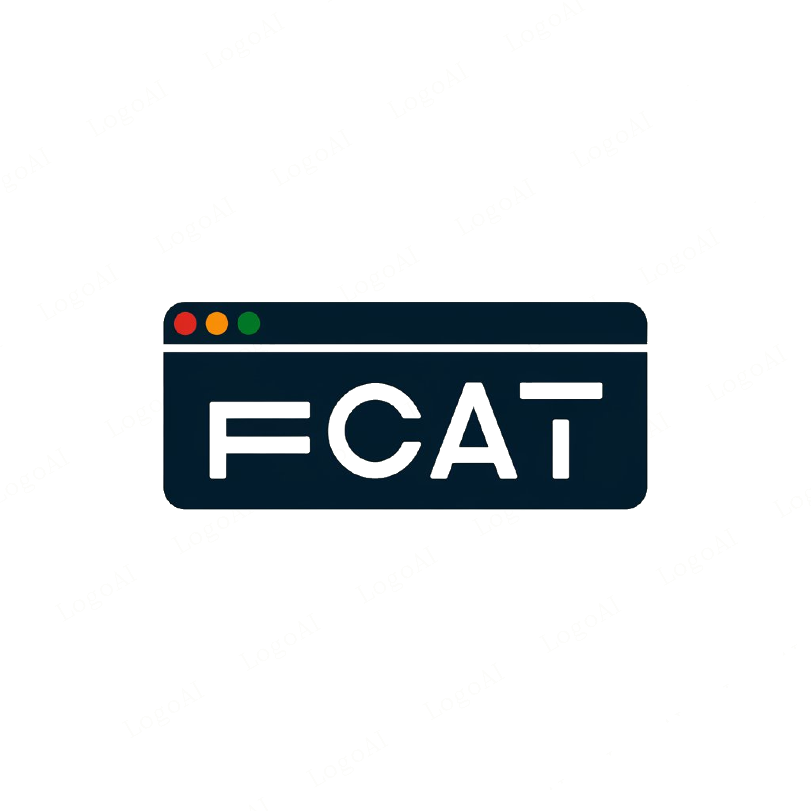

# fcat - File Concatenator

<p align="center">
  
</p>

<p align="center">
  <a href="https://github.com/thomasalmeida/fcat/releases/latest"></a>
  <a href="https://github.com/thomasalmeida/fcat/actions"></a>
  <a href="https://aur.archlinux.org/packages/fcat/"></a>
  <a href="https://crates.io/crates/fcat"></a>
  <a href="https://github.com/thomasalmeida/fcat/blob/main/LICENSE"></a>
</p>

A high-performance command-line file concatenator written in Rust, designed to safely aggregate text files while automatically ignoring binary and media files. Features clipboard integration and smart filtering.

## Features

- 📋 **Automatic clipboard copying** (wl-copy required)
- ⚡ **Intelligent binary file detection** - No more corrupted output
- 🛡️ **Safe path handling and permission checks**
- 🔍 **Advanced glob pattern matching** for ignores
- 📁 **Recursive directory processing**
- 📦 **Cross-platform** with single binary deployment

## Installation

### From Package Managers

#### Debian/Ubuntu

```bash
# Add repository
sudo add-apt-repository ppa:thomasalmeida/fcat
sudo apt update

# Install package
sudo apt install fcat
```

#### Arch Linux (AUR)

```bash
# Using yay
yay -S fcat

# Or with paru
paru -S fcat

# Or manually
git clone https://aur.archlinux.org/fcat.git
cd fcat
makepkg -si
```

#### Cargo (Rust Package Manager)

```bash
cargo install fcat
```

### Direct Download

```bash
# Download latest release
curl -LO https://github.com/thomasalmeida/fcat/releases/latest/download/fcat-linux-amd64
chmod +x fcat-linux-amd64
sudo mv fcat-linux-amd64 /usr/local/bin/fcat
```

### From Source

```bash
# Clone repository
git clone https://github.com/thomasalmeida/fcat
cd fcat

# Build and install
make install
```

## Usage

**Important:** For proper ignore pattern handling, specify paths first and the `-i` flag afterward. All arguments following `-i` will be treated as ignore patterns.

```bash
fcat [PATHS]... [OPTIONS]

Options:
  -o, --output [FILE]      Save output to file (default: paste.txt)
  -i, --ignore <PATTERN>   Ignore files/directories matching glob patterns
  -h, --help               Print help
  -V, --version            Print version
```

## Examples

```bash
# Process all .rs files, ignoring ".git", "target", and files ending in ".lock"
fcat *.rs -i .git target *.lock

# Process multiple directories with ignore patterns
fcat src/ tests/ -i target "*.bin" "*.tmp" -o output.log

# Combine specific files and directories
fcat *.md docs/ examples/*.txt -i node_modules
```

## Performance Tips

Use more specific patterns for better performance:

```bash
# Good
fcat . -i target "*.log"

# Better (specific directory exclusion)
fcat . -i "**/node_modules/**" "*.zip"
```

## Contributing

Contributions are welcome! Please feel free to submit a Pull Request.

1. Fork the repository
2. Create your feature branch (`git checkout -b feature/amazing-feature`)
3. Commit your changes (`git commit -m 'Add some amazing feature'`)
4. Push to the branch (`git push origin feature/amazing-feature`)
5. Open a Pull Request

## License

This project is licensed under the MIT License - see the [LICENSE](LICENSE) file for details.
